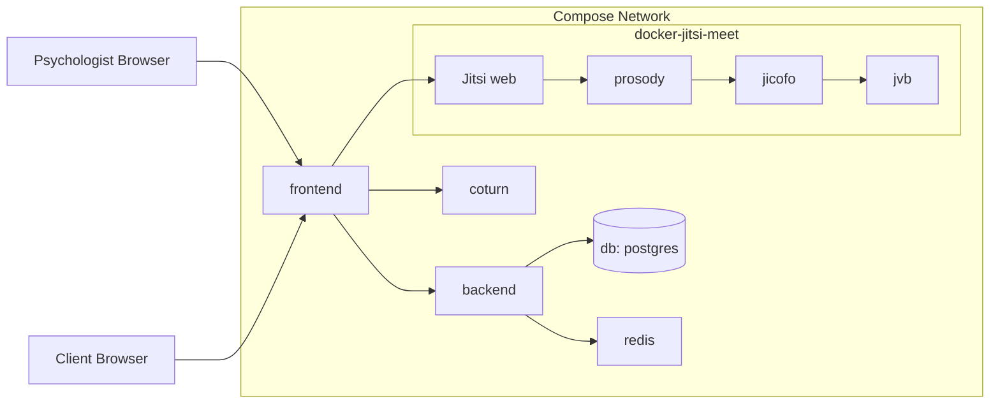
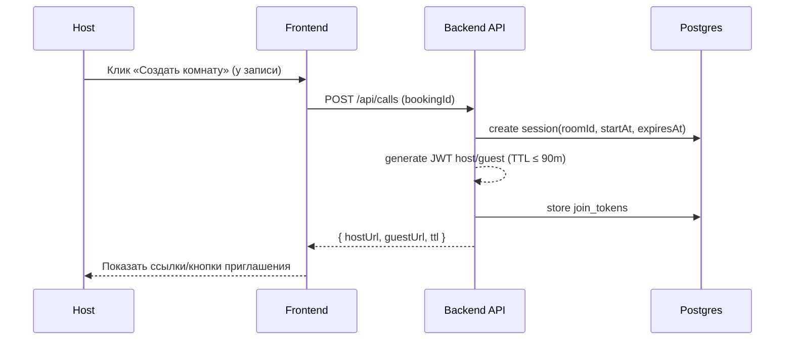

# Архитектура видеосервиса (локальный стенд)

## Контекстная диаграмма
```mermaid
flowchart LR
  subgraph Client_Side[Клиенты]
    P[Психолог (Host)\nБраузер]
    C[Клиент (Guest)\nБраузер]
  end

  FE[Frontend (React)]
  BE[Backend (API)]
  DB[(Postgres)]
  R[(Redis)]

  subgraph Jitsi Cluster
    JW[Jitsi Web]
    PR[Prosody (XMPP + JWT)]
    JC[Jicofo]
    JVB[JVB (SFU)]
  end

  T[TUR N (coturn)\n3478/udp,tcp; 5349/tls]

  P --> FE
  C --> FE
  FE --> BE
  BE --> DB
  BE --> R

  FE -->|IFrame API + JWT| JW
  JW --> PR
  PR --> JC
  JC --> JVB
  P <-->|SRTP/DTLS| JVB
  C <-->|SRTP/DTLS| JVB
  P <-->|ICE/STUN/TURN| T
  C <-->|ICE/STUN/TURN| T
```

Примечания:
- Доступ в комнату возможен только с JWT (роль host/guest, ограниченный TTL).
- TURN обязателен; при блокировке UDP — fallback через `5349/tls`.

## Диаграмма контейнеров (Docker Compose)


Рекомендация: вынести Jitsi + coturn в `docker-compose.override.yml` (локальный стенд) и затем в отдельный стек на VPS.

## Диаграммы последовательностей

### Создание комнаты


### Подключение и таймер
```mermaid
sequenceDiagram
  participant User as Host/Guest
  participant FE as Frontend (/calls/:roomId)
  participant JW as Jitsi Web
  participant PR as Prosody (JWT)
  participant JVB as Jitsi VideoBridge
  participant CT as TURN
  participant BE as Backend

  User->>FE: Открыть страницу комнаты (с JWT)
  FE->>JW: Инициализация IFrame API c токеном
  JW->>PR: Аутентификация JWT
  PR-->>JW: OK (role, room)
  FE->>JVB: WebRTC (ICE, SRTP/DTLS)
  FE->>CT: TURN при необходимости (relay)
  Note over FE: Запуск таймера 90 мин; за 15 мин — предупреждение
  FE->>BE: Webhook событий (joined/left/errors)
  FE-->>User: По истечении — hangup, блок повторного входа
  BE-->>FE: /status → expired/ended
```

## Данные и модели (см. L3)
- `sessions { id, roomId, hostId, clientId, startAt, expiresAt, status }`
- `join_tokens { sessionId, userId, role, jwt, expiresAt }`
- `call_logs { sessionId, userHash, event, timestamp }`

Индексы: `roomId`, `sessionId`, `expiresAt`.

## JWT (Jitsi)
- Роли: `context.user.role ∈ { host, guest }`.
- Ограничения: `exp ≤ startAt + 90m`.
- Клеймы (концептуально):
```json
{
  "aud": "psyform-calls",
  "iss": "psyform-backend",
  "sub": "jitsi.local",
  "room": "<roomId>",
  "exp": 1735689600,
  "context": { "user": { "name": "<masked>", "role": "host" } }
}
```

> Конкретные переменные окружения docker-jitsi-meet для JWT/гостевого доступа/TURN зависят от версии образов. На этапе L2 уточним и приведём рабочие примеры конфигураций для вашего стенда.
